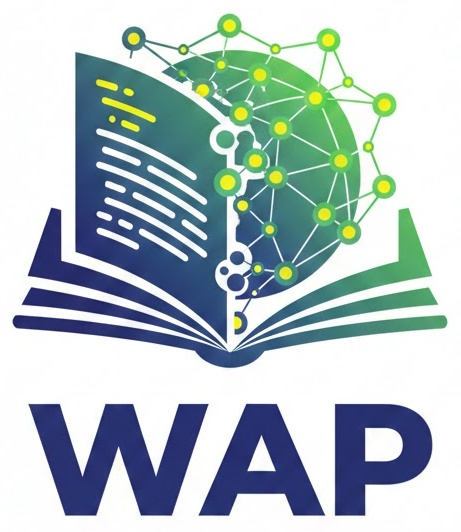

# Web Any Paper (WAP)

<p align="center">
  
</p>

WAP is a static site that turns papers into bilingual (EN/中文) and dual-level (HS/Grad) web pages. Each paper is its **own** HTML/CSS/JS bundle.

## Structure

- `index.html` — WAP home + paper index
- `app.js` — search + language/level toggle for the index
- `papers/<slug>/index.html` — standalone paper page
- `papers/<slug>/styles.css`
- `papers/<slug>/script.js`
- `vercel.json` — rewrites `/<slug>` → `/papers/<slug>/index.html`

## Add a paper

1) Create a folder: `papers/<slug>/`
2) Add three files inside:
   - `index.html`
   - `styles.css`
   - `script.js`
3) Add a card link to the index page in `index.html`.
4) Push to GitHub → Vercel deploys automatically.

## Local preview

```
python3 -m http.server 8000
```

Then open `http://localhost:8000`.
